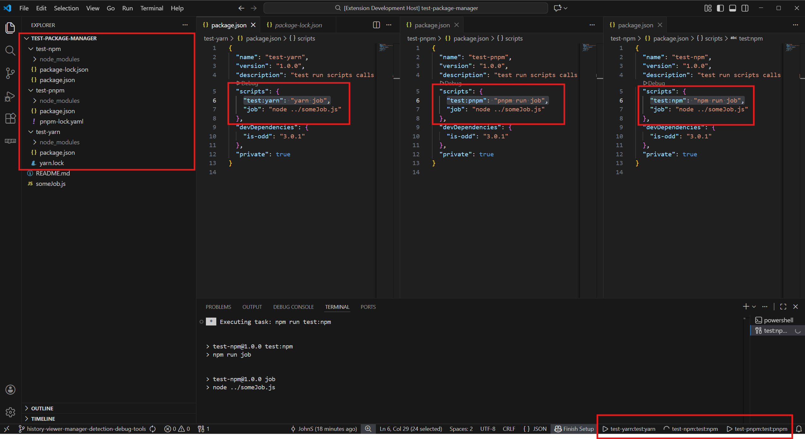
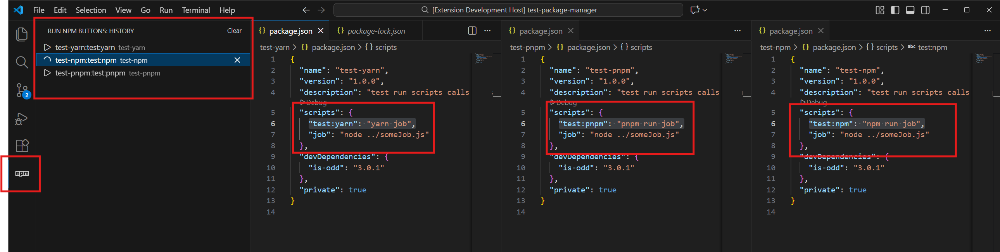

# Run NPM Buttons

Run NPM Buttons is a VS Code / Cursor extension that provides quick access to your most used npm scripts directly from the status bar.  
It remembers which scripts you have executed in the current workspace and creates a persistent toolbar for them.



## Features

- Adds compact buttons in the status bar for npm scripts.
- Scripts appear only after they have been executed at least once (workspace history).
- Supports monorepos: sub-packages show scripts using `folderName:scriptName`.
- Tracks script state:
  - idle → play button
  - running → animated indicator or solid square, automatically reset when finished
- Works both when you start scripts from the extension or from the built-in NPM Scripts Explorer.
- Provides a dedicated history view in the sidebar for managing and rerunning scripts.

## Sidebar history view



The extension adds a Run NPM Buttons item to the Activity Bar (left sidebar).  
Inside it there is a History view:

- Each entry corresponds to a script you have run in this workspace.
- The main label shows `folderName:scriptName`.
- The secondary text shows the script folder path relative to the workspace root.
- The icon on the left shows whether the script is currently running or idle (same status as in the status bar).
- Double-click an item to start or stop that script.
- Hover an item to reveal a small remove button on the right that deletes this script from history.
- The header of the History view contains a Clear button that removes all history entries for the current workspace.
- If you don't like this sidebar menu - hide it (right click on activitiy bar and untoggle "Run NPM buttons")

The status bar and the sidebar are always in sync: starting/stopping a script via either place immediately updates the other.

## Package manager detection

Run NPM Buttons automatically chooses how to run your scripts based on the project setup.  
For each script it tries to detect the package manager by walking up the folder tree and looking for:

- `yarn.lock` → run with `yarn`
- `pnpm-lock.yaml` → run with `pnpm`
- `bun.lockb` → run with `bun`
- `package-lock.json` → run with `npm`
- If only `package.json` is found, it also checks its `packageManager` field and uses the corresponding tool if it starts with `yarn`, `pnpm`, `bun`, or `npm`.

If nothing is detected, it falls back to `npm`.

This detection works for packages in subfolders as well, which is useful in monorepos.

## Installation

From Open VSX (recommended for Cursor/VSCodium):  
https://open-vsx.org/extension/johnsutray/run-npm-buttons

From VS Code Marketplace:  
https://marketplace.visualstudio.com/items?itemName=johnsutray.run-npm-buttons

Or locally with a `.vsix` file:

```bash
vsce package
code --install-extension run-npm-buttons-0.0.1.vsix
```

## Configuration

| Setting | Type | Default | Description |
|--------|------|---------|-------------|
| `runNpmButtons.spinIcon` | `boolean` | `true` | When a script is running, choose between showing an animated spinner (`true`) or a static square (`false`). |

## Developing and debugging the extension

If you want to inspect or modify the extension locally:

1. Clone the repository:

   ```bash
   git clone https://github.com/your-username/run-npm-buttons.git
   cd run-npm-buttons
   ```

2. Install dependencies:

   ```bash
   npm install
   ```

3. Open the folder in VS Code or Cursor.

4. Check `.vscode/launch.json`.  
   The repository contains a ready-made launch configuration named something like “Run Extension”.  
   It starts an Extension Development Host with this extension loaded.

5. Press `F5` (or run the “Run Extension” configuration from the Run and Debug view).

   This opens a new VS Code window (Extension Development Host) where you can:
  - run npm scripts so that they appear in the status bar and in the sidebar history,
  - test starting/stopping scripts from both places,
  - verify history removal and the Clear button in the sidebar.

6. To debug, set breakpoints in the extension source (for example in `extension.js`) and use the original window’s debugger controls (step, continue, inspect variables, and so on).
